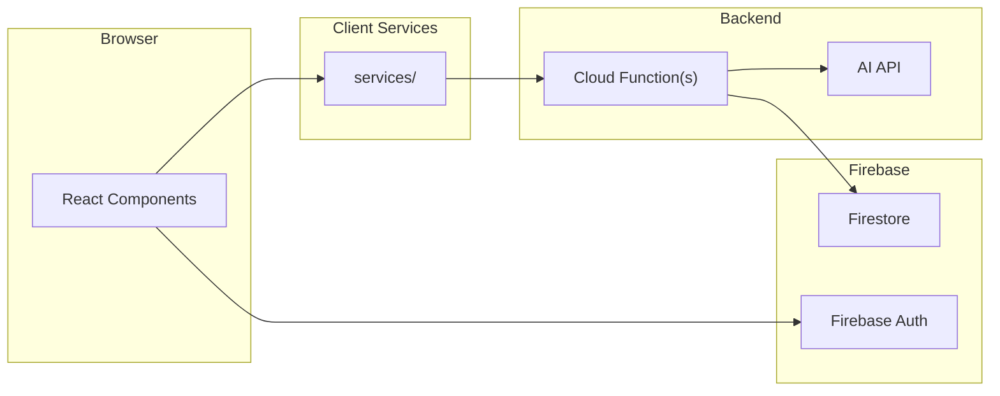
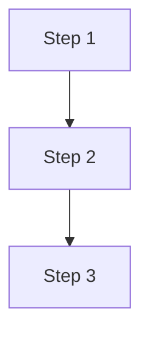

# [Project Name] — Function Map

A reference for how all functions in the app connect and what each one does. Keep this updated when major functions are added or removed; line numbers are intentionally omitted as they go stale quickly.

---

## Architecture Overview

---

## Key User Flows

### 1. [Primary Flow Name]

---

## Function Reference

### `src/lib/[filename].ts`

| Function | Description | Key Interactions |
|---|---|---|
| `functionName` | What it does | What it calls / what calls it |
